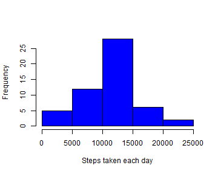
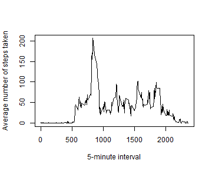
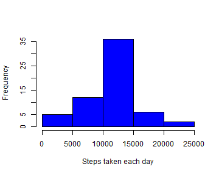
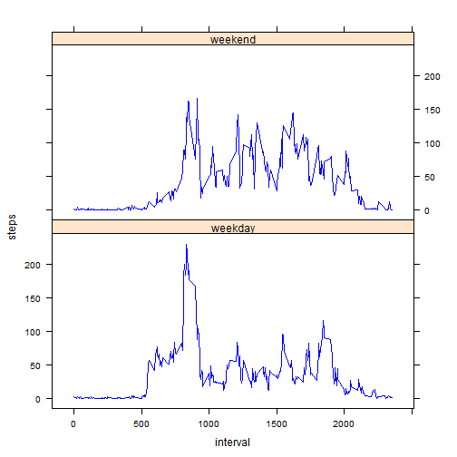

Reproducible Research - Peer Assessment 1
========================================================

**Loading and preprocessing the data**  
Show any code that is needed to  
1. Load the data  
2. Process/transform the data into a format suitable for the analysis


```r
data<-read.csv("activity.csv")
index<-duplicated(data$date)
df<-data.frame(data$date[!index])
names(df)[1]<-"date"
df$steps<-rep(0,dim(df)[1])
for (i in 1:dim(df)[1]){
    subset<-data[data$date==df$date[i],]
    df$steps[i]<-sum(subset$steps)
}
```

**What is mean total number of steps taken per day?**  
For this part of the assignment, missing values in the dataset are ignored.  
1. Make a historgram of the total number of steps taken each day  
2. Calculate and report the **mean** and **median** total number of steps taken per day  


```r
df<-na.omit(df)
hist(df$steps,col="blue",xlab="Steps taken each day",main="")
```

 


```r
mean<-as.character(round(mean(df$steps),0))
median<-as.character(round(median(df$steps),0))
```
The mean total number of steps taken per day is 10766 and the median total number of steps taken per day is 10765.

**What is the average daily activity pattern?**  
1. Make a time series plot of the 5-minute interval (x-axis) and the average number of steps taken, averaged across all days (y-axis)  
2. Which 5-minute interval, on average across all the days in the dataset, contains the maximum number of steps?  


```r
index2<-duplicated(data$interval)
df2<-data.frame(data$interval[!index2])
names(df2)[1]<-"interval"
for (i in 1:dim(df2)[1]){
    subset2<-data[data$interval==df2$interval[i],]
    df2$steps[i]<-mean(subset2$steps,na.rm=T)
}
plot(df2$interval,df2$steps,type="l",ylab="Average number of steps taken",xlab="5-minute interval")
```

 


```r
mi<-df2[df2$steps==max(df2$steps),][1,1]
```

In the #835 5-minute interval, on average across all the days in the data sets, contains the maximum number of steps.

**Imputing missing values**  
Note that there are a number of days/intervals where there are missing values (coded as NA). The presence of missing days may introduce bias into some calculations or summaries of the data.  
1. Calculate and report the total number of missing values in the dataset (i.e. the total number of rows with NAs)  
2. Devise a strategy for filling in all of the missing values in the dataset. The strategy does not need to be sophisticated. For example, you could use the mean/median for that day, or the mean for that 5-minute interval, etc.  
3. Create a new dataset that is equal to the original dataset but with the missing data filled in.  
4. Make a histogram of the total number of steps taken each day and Calculate and report the mean and median total number of steps taken per day. Do these values differ from the estimates from the first part of the assignment? What is the impact of imputing missing data on the estimates of the total daily number of steps?  


```r
NAsteps<-data
row<-dim(NAsteps[NAsteps$steps=="NA",])[1]
```

The total number of rows with NAs is 2304.


```r
dataframe<-data.frame()
for (i in 1:dim(df2)[1]){
  dataframe1<-NAsteps[NAsteps$interval==df2$interval[i],]
  dataframe1$steps[is.na(dataframe1$steps)]<-df2$steps[i]
  dataframe<-rbind(dataframe,dataframe1)
}
dataframe<-dataframe[order(dataframe$date),]
```

I use the mean for that 5-minute interval to fill all the missing values in the dataset. The new dataset is named "dataframe".  


```r
index1<-duplicated(dataframe$date)
df1<-data.frame(dataframe$date[!index])
names(df1)[1]<-"date"
df1$steps<-rep(0,dim(df1)[1])
for (i in 1:dim(df1)[1]){
    subset<-dataframe[dataframe$date==df1$date[i],]
    df1$steps[i]<-sum(subset$steps)
}
hist(df1$steps,col="blue",xlab="Steps taken each day",main="")
```

 

```r
mean1<-as.character(round(mean(df1$steps),0))
median1<-as.character(round(median(df1$steps),0))
```

The mean total number of steps taken per day is 10766 and the median total number of steps taken per day is 10766. There is almost no change on mean and median values. Imputing missing data on the estimates of the total daily number of steps makes the frequecy of 10000 - 15000 interval higher much higher than the first histogram.  

**Are there differences in activity patterns between weekdays and weekends?**  
1. Create a new factor variable in the dataset with two levels "weekday" and "weekend" indicating whether a given date is a weekday or weekend day.  
2. Make a panel plot containing a time series plot (i.e. type = "l") of the 5-minute interval (x-axis) and the average number of steps taken, averaged across all weekday days or weekend days (y-axis).   


```r
dataframe$date<-as.Date(as.character(dataframe$date),'%Y-%m-%d')
dataframe$weekdays<-weekdays(dataframe$date)
dataframe$category<-rep("weekday",dim(dataframe)[1])
for (i in 1:dim(dataframe)[1]){
    if (dataframe$weekdays[i]=="Sunday"){
        dataframe$category[i]<-"weekend"
    }
    if (dataframe$weekdays[i]=="Saturday"){
        dataframe$category[i]<-"weekend"
    }
}
```


```r
dataframe2<-df2
dataframe2$category<-rep("weekday",dim(dataframe2)[1])
for (i in 1:dim(dataframe2)[1]){
    subset3<-dataframe[dataframe$interval==dataframe2$interval[i] & dataframe$category=="weekday",]
    dataframe2$steps[i]<-mean(subset3$steps)
}
dataframe3<-df2
dataframe3$category<-rep("weekend",dim(dataframe3)[1])
for (i in 1:dim(dataframe3)[1]){
    subset4<-dataframe[dataframe$interval==dataframe3$interval[i] & dataframe$category=="weekend",]
    dataframe3$steps[i]<-mean(subset4$steps)
}
dataframe4<-rbind(dataframe2,dataframe3)
library(lattice)
xyplot(steps~interval|factor(category),type="l",col.line="blue",data=dataframe4,layout=c(1,2))
```

 
